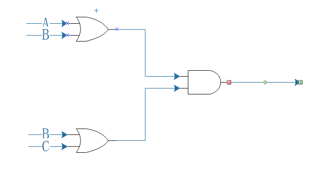

<html lang="en">

<head>
	<meta charset="utf-8" />
	<title>作业5</title>
	<link type="text/css" href="homework.css" rel="stylesheet" media="screen" />
</head>

<body>
		<h1>Part1</h1>
		
1)与门

		
答：二进制数的“与”相当于对应的每一位相乘.

		<ol>
			<li>111 & 000 = 000</li>
			<li>101 & 111 = 101</li>
			<li>011 & 011 = 011</li>
		</ol>

		
2)异或门

		
答：不同则为“1”，相同则为“0”

		<ol>
			<li>111 XOR 000 = 111</li>
			<li>101 XOR 111 = 010</li>
			<li>011 XOR 011 = 000</li>
		</ol>

		
3)Draw a circuit diagram corresponding to the following Boolean expression: (A + B)(B + C)

		

		
4)Show the behavior of the following circuit with a truth table:

		
答：

		<table>
			<tr><th>A</th><th>B</th><th>Result</th></tr>
			<tr><td>0</td><td>0</td><td>1</td></tr>
			<tr><td>0</td><td>1</td><td>1</td></tr>
			<tr><td>1</td><td>0</td><td>0</td></tr>
			<tr><td>1</td><td>1</td><td>1</td></tr>
		</table>

		
5)What is circuit equivalence? Use truth table to prove the following formula.

		
答：

		<table>
			<tr><th>A</th><th>B</th><th>Left</th><th>Right</th></tr>
			<tr><td>0</td><td>0</td><td>1</td><td>1</td></tr>
			<tr><td>0</td><td>1</td><td>1</td><td>1</td></tr>
			<tr><td>1</td><td>0</td><td>1</td><td>1</td></tr>
			<tr><td>1</td><td>1</td><td>0</td><td>0</td></tr>
		</table>
		<h1>Part2</h1>
		
6)There are eight 1bit full adder integrated circuits. Combine them to 8bit adder circuit using the following box diagram.

		
7)

		<ol>
			<li>(X8X7X6X51111)2</li>
			<li>(X8X7X6X5X'4X'3X'2X'1)2</li>
			<li>(X8X7X6X5X'4X'3X'2X'1)2</li>
		</ol>
		<h1>Part3</h1>
		<h2>wiki解释名词</h2>
		<h3>Logic gate</h3>
		
In electronics, a logic gate is an idealized or physical device implementing a Boolean function; that is, it performs a logical operation on one or more binary inputs and produces a single binary output.

		<h3>Boolean algebra</h3>
		
In mathematics and mathematical logic, Boolean algebra is the branch of algebra in which the values of the variables are the truth values true and false, usually denoted 1 and 0 respectively.

		<h2>Flip-flop</h2>
		
1)Flip-flop 中文翻译是?

		
答：触发器。

		
2)How many bits information does a SR latch store?

		
答：An SR latch consists of two NAND gates and is commonly used to store one bit of information.

